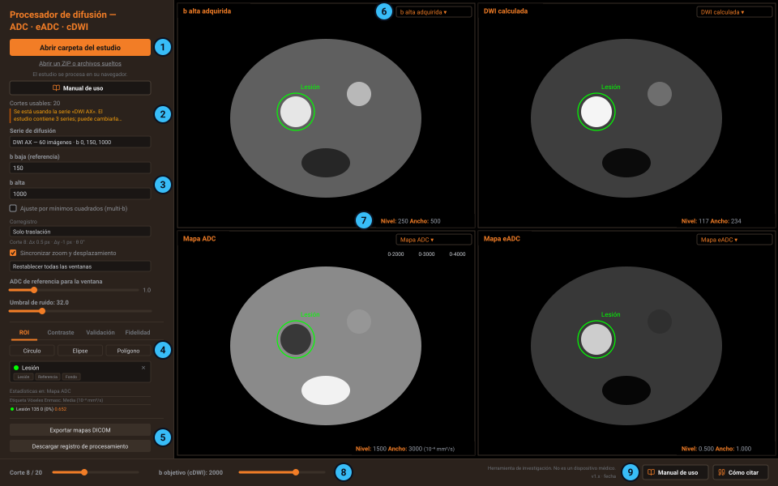

# Manual de uso

El **Procesador de difusión** calcula mapas de ADC, de ADC exponencial (eADC) y de
difusión calculada (cDWI) a partir de la serie de difusión de un estudio de resonancia
magnética. Funciona en el navegador: las imágenes se leen y se procesan en su propio
equipo y no se envían a ningún servidor.

Este manual explica cómo abrir un estudio, qué hace cada parámetro, cómo leer y medir
los mapas, cómo exportarlos y qué significa cada aviso. Se abre desde la aplicación con
el botón **Manual de uso**, y desde su página se puede imprimir o guardar en PDF.

> [!IMPORTANT]
> Es una herramienta de investigación, no un dispositivo médico certificado. Interprete
> siempre los mapas derivados junto con las imágenes adquiridas originales.

## En resumen

1. Abra la aplicación en **https://difusion-rm.pages.dev**, o la versión instalada.
2. Arrastre a la ventana la carpeta del estudio, su ZIP o el contenido del CD.
3. Lea los avisos de la barra lateral y compruebe que la serie en uso es la de difusión.
4. Revise los parámetros: b baja, b alta, b objetivo y corregistro. Los mapas se
   recalculan solos al cambiarlos.
5. Mida con ROI y, si necesita los mapas fuera de la aplicación, expórtelos como series
   DICOM.

## Antes de empezar

### Qué necesita

- **Una computadora con mouse** y un navegador actualizado: Chrome, Edge, Firefox o
  Safari. Funciona también con trackpad. No está pensada para celulares ni tabletas: las
  ROI y la ventana se manejan con el mouse.
- **El estudio en DICOM**, con la secuencia de difusión: al menos dos valores b.
- **Memoria suficiente.** Todo lo que se abre se carga en la memoria del navegador. Si el
  estudio es muy grande y el equipo se ralentiza, abra solo la carpeta de la serie de
  difusión.

No hay que instalar nada ni crear ninguna cuenta.

### Privacidad

- **Las imágenes no salen de su equipo.** La aplicación no tiene servidor de cálculo, y su
  política de seguridad impide que la página se conecte a cualquier sitio distinto del
  suyo propio.
- Al elegir una carpeta, el navegador puede preguntar si quiere **«subir»** sus archivos.
  Es el texto estándar del navegador para dar acceso a una carpeta: los archivos solo se
  leen en su equipo.
- **Los DICOM que exporta conservan los datos del paciente y del estudio original**, para
  que el visor o el PACS los agrupen con ese estudio. Trátelos con la misma
  confidencialidad que el original.
- Las tablas CSV y el registro de procesamiento no incluyen datos del paciente.

### Instalarla y usarla sin conexión

La aplicación se puede instalar como un programa más: en Chrome o Edge, con el botón de
instalar de la barra de direcciones; en Safari para Mac, con *Archivo → Añadir al Dock*.
Instalada o no, una vez cargada funciona **sin conexión a internet**, por ejemplo en una
sala de informes sin red.

Las versiones nuevas se descargan solas y se activan al volver a abrir la aplicación o al
recargar la página. La versión en uso y su fecha aparecen en la barra inferior.

## La pantalla



1. **Abrir el estudio.** El botón naranja abre una carpeta; el enlace de debajo, un ZIP
   o archivos sueltos. Más abajo, el botón **Manual de uso** abre este manual.
2. **Estado y avisos.** Número de cortes usables, avisos en ámbar y serie de difusión en
   uso.
3. **Parámetros del cálculo.** b baja, b alta, ajuste multi-b, corregistro, umbral de
   ruido y ajustes de visualización.
4. **Pestañas de medida.** *ROI*, *Contraste*, *Validación* (solo si el estudio trae el
   ADC del equipo) y *Fidelidad*.
5. **Exportar.** Mapas DICOM y registro de procesamiento.
6. **Paneles.** Cuatro vistas del mismo corte. El selector de la esquina superior derecha
   de cada panel elige qué mapa muestra.
7. **Ventana.** Nivel y ancho de la ventana de cada panel.
8. **Corte y b objetivo.** Deslizadores de la barra inferior.
9. **Manual y cita.** Los botones **Manual de uso** y **Cómo citar**, siempre a la
   vista, junto al número de versión.

Antes de abrir un estudio, la zona de los paneles muestra una bienvenida con los tres
pasos básicos.

## Abrir el estudio

La aplicación acepta el estudio tal como lo tenga, sin prepararlo:

- una **carpeta** copiada del PACS o de un CD, incluidos los archivos sin extensión
  (`IM_0001`, `00000001`…) que traen muchos CD;
- el **ZIP** exportado del PACS;
- **archivos DICOM sueltos**.

Hay tres formas de abrirlo:

- **Arrastrar y soltar** la carpeta, el ZIP o los archivos sobre cualquier parte de la
  ventana. Al pasar por encima aparece el aviso *Suelte aquí la carpeta del estudio*.
- **Abrir carpeta del estudio**, el botón naranja, para elegir una carpeta completa con sus
  subcarpetas.
- **Abrir un ZIP o archivos sueltos**, para elegir un ZIP o varios archivos a la vez.

Abra **un solo ZIP** cada vez: si selecciona o arrastra varios juntos, no se descomprimen.

No hace falta retirar lo que acompaña a las imágenes. Los archivos que por su nombre no
pueden ser imágenes (el visor del CD y su instalador, informes PDF, fotos JPEG, textos,
`DICOMDIR`) se descartan sin leerlos, y cualquier otro archivo que no sea DICOM se ignora.

### Qué ocurre al cargar

La barra lateral muestra el progreso en tres fases, *Lectura DICOM*, *Agrupación* y
*Cálculo*. Al terminar aparecen los cuatro paneles con los mapas calculados con los
parámetros por defecto. Mientras tanto, la aplicación:

1. **Lee el valor b de cada imagen**, buscándolo por orden de fiabilidad: el tag estándar
   de valor b, la secuencia de difusión, los tags privados de Siemens, GE y Philips y,
   como último recurso, el nombre de la secuencia o la descripción de la serie. Si tuvo
   que deducirlo de un texto, o no lo encontró, lo avisa.
2. **Separa las series** y localiza la de difusión. Un estudio completo del PACS trae
   también T1, T2, STIR o dinámicos; esas series no entran en el cálculo.
3. **Promedia las imágenes repetidas**, las que coinciden en posición y valor b (varias
   adquisiciones o direcciones de difusión).
4. **Empareja los cortes** de b baja y b alta por su posición.
5. **Aparta el mapa ADC del equipo**, si el estudio lo trae, para poder compararlo en la
   pestaña [Validación](#validación-frente-al-adc-del-equipo).

Encima de los parámetros se indica cuántos **cortes usables** hay: cuántas posiciones
tienen imagen en los dos valores b.

### Elegir la serie de difusión

Si el estudio contiene más de una serie, aparece el desplegable **Serie de difusión**, con
la descripción de cada serie, su número de imágenes y sus valores b (o *sin valores b*).
La aplicación elige sola la serie de difusión con más valores b y avisa de cuál está
usando. Si no es la que quiere, elija otra: el cálculo se rehace sin volver a leer los
archivos.

Algunos equipos guardan cada valor b en una serie distinta. Si comparten matriz y marco de
referencia, la aplicación las reúne en un solo conjunto, y la descripción lo indica con
*(+1)*, *(+2)*… El mapa ADC del equipo suele quedar reunido así con la difusión.

Si elige una serie *sin valores b*, el cálculo se detiene con el aviso *Los dos valores b
seleccionados son iguales*. Vuelva a elegir la serie de difusión.

> [!NOTE]
> Al cambiar de serie o abrir otro estudio, los parámetros vuelven a sus valores por
> defecto y la vista vuelve al primer corte. Al abrir otro estudio se borran, además, las
> ROI.

### Formatos que lee

- DICOM **sin comprimir**, en sus variantes habituales (VR implícito o explícito, *little*
  o *big endian*).
- DICOM comprimido en **JPEG sin pérdida**, el más frecuente en los PACS.

Todavía no lee JPEG con pérdida, JPEG-LS, JPEG 2000, RLE ni *deflate*, ni imágenes
**multifotograma** (un solo archivo con todos los cortes, típico del DICOM *enhanced*). Si
el estudio viene así, expórtelo desde el PACS o la consola sin comprimir, o en JPEG sin
pérdida, con un archivo por imagen. La aplicación dice cuántos archivos no pudo leer y por
qué.

## Configurar el cálculo

Los mapas se recalculan solos cada vez que cambia un parámetro; mientras tanto, la barra
lateral muestra el progreso. Al abrir el estudio, la aplicación propone valores
razonables: revíselos antes de medir.

### b baja y b alta

El ADC de dos puntos se calcula entre la **b baja (referencia)** y la **b alta**, que se
eligen en sus desplegables entre los valores b de la serie, en s/mm².

- Por defecto, la **b alta** es el mayor valor b de la serie.
- La **b baja** es, por defecto, el menor valor b igual o superior a 150 s/mm² que quede
  por debajo de la b alta; si no hay ninguno, el menor valor b.
- La b baja tiene que ser **menor** que la b alta. Si elige dos valores iguales, el cálculo
  se detiene; si la b baja es mayor, todos los vóxeles quedan fuera de rango y los mapas
  salen negros.

Si la b baja es menor de 150 s/mm², aparece una advertencia en ámbar. Con b muy bajas, la
microperfusión capilar (efecto IVIM) sobreestima el ADC y resta exactitud a la cDWI; lo
recomendable es adquirir una b de 100–150 s/mm² y usarla como referencia. Es un aviso,
no una prohibición: si la serie solo tiene b = 0, úsela sabiendo que el ADC saldrá
sobreestimado. En los DICOM exportados, la descripción de serie lleva entonces la marca
*[LOW-B<150]*.

### Ajuste multi-b

Con tres o más valores b aparece la casilla **Ajuste por mínimos cuadrados (multi-b)**. En
lugar de dos puntos, ajusta una recta ponderada al logaritmo de la señal frente a b con
**todos** los valores b de la serie. Así el ruido se reparte entre más imágenes y se
obtiene el mapa de **bondad de ajuste (R²)**.

- Usa todos los valores b, incluido b = 0 si la serie lo tiene: el sesgo por
  microperfusión aplica igual.
- La b baja elegida sigue siendo la referencia del corregistro: las demás imágenes se
  alinean con ella.
- La b alta elegida solo decide qué imagen se muestra como *b alta adquirida* y con cuál
  se compara la [fidelidad](#fidelidad-de-la-dwi-calculada).
- La cDWI se calcula desde la señal ajustada en b = 0, no desde la señal medida en b baja.
- El eADC usa el mayor valor b de la serie.

### Corregistro

Alinea en cada corte la imagen de b alta (con multi-b, la de cada valor b) con la de b
baja, para corregir pequeños movimientos entre adquisiciones. Usa información mutua y
busca dentro de ±8 píxeles y, si incluye rotación, de ±3°.

| Modo | Qué corrige |
| --- | --- |
| **Solo traslación** (por defecto) | Desplazamientos horizontales y verticales |
| **Traslación + rotación** | Además, un giro pequeño |
| **Sin corregistro** | Nada: usa las imágenes tal como vienen |

Bajo el desplegable se ve la corrección aplicada a la b alta en el corte actual: Δx y Δy
en píxeles y θ en grados. Si la mejor solución se sale de los límites, se rechaza y se
aplica un modo más simple, con un aviso en ámbar: *Corte n: solución rechazada, se aplicó
…*.

El corregistro es dentro del plano de cada corte: no corrige el movimiento entre cortes ni
la distorsión geométrica propia de la secuencia de difusión.

### Umbral de ruido y máscara

Para no calcular ADC sobre ruido, los mapas llevan una **máscara**. Un vóxel es válido si:

- su señal en b baja supera el **umbral de ruido**;
- su señal en b alta es mayor que cero (con multi-b, en todos los valores b);
- el ADC resultante está entre 0 y 4 × 10⁻³ mm²/s.

Los vóxeles que no cumplen se ven negros en todos los mapas, no cuentan en las
estadísticas y se exportan con valor 0.

El umbral inicial se estima del fondo de la imagen: la media más tres desviaciones
estándar de cuatro cuadrados de 16 × 16 píxeles, en las esquinas de la imagen de b baja
del corte central. El deslizador **Umbral de ruido** permite moverlo entre la mitad y cinco
veces ese valor; el cambio se aplica **al soltar el mouse**.

- Súbalo si quedan puntos de ruido fuera del paciente.
- Bájelo si la máscara se come tejido de señal baja que quiere medir.

Si el campo de visión es tan ajustado que alguna esquina de la imagen cae dentro del
paciente, el umbral estimado sale alto: compruebe que la máscara no recorta tejido.

### b objetivo

El deslizador **b objetivo (cDWI)** de la barra inferior fija el valor b al que se calcula
la DWI: de 0 a 3000 s/mm², en pasos de 50, con 2000 por defecto. Puede ser mayor que la b
alta adquirida, que es lo habitual (se extrapola), o menor (se interpola).

Por encima de 2000 s/mm² aparece un aviso: el modelo monoexponencial deja de describir
bien la señal y el ruido se amplifica. Interprete esas imágenes con cautela.

### Ajustes de visualización

Estos controles cambian cómo se ven los mapas, no sus valores ni lo que se exporta:

- **Sincronizar zoom y desplazamiento** (activado por defecto): el zoom y el
  desplazamiento de un panel se aplican a los cuatro, y el ajuste de ventana con el mouse
  se copia a los paneles que muestran el mismo mapa.
- **Restablecer todas las ventanas**: devuelve los cuatro paneles a su ventana inicial.
- **ADC de referencia para la ventana** (de 0,5 a 3,0 × 10⁻³ mm²/s; 1,0 por defecto): al
  cambiar la b objetivo, la ventana de la DWI calculada se reajusta para que un tejido con
  ese ADC conserve su brillo aparente. Así, al subir la b objetivo la imagen no se
  oscurece entera, y destaca lo que difunde menos que la referencia.

## Revisar los mapas

### Qué muestra cada panel

Los cuatro paneles muestran el mismo corte. Por defecto: *b alta adquirida* arriba a la
izquierda, *DWI calculada* arriba a la derecha, *Mapa ADC* abajo a la izquierda y *Mapa
eADC* abajo a la derecha. El selector de la esquina superior derecha de cada panel cambia
lo que muestra:

| Mapa | Qué es | Cómo se lee |
| --- | --- | --- |
| **b baja** | Imagen adquirida en la b de referencia | Base del cálculo y de la máscara |
| **b alta adquirida** | Imagen adquirida en la b alta, ya corregistrada | La restricción se ve brillante, pero también lo muy brillante en T2 |
| **Mapa ADC** | Coeficiente de difusión aparente | La restricción se ve **oscura**; el líquido, brillante |
| **Mapa eADC** | exp(−b · ADC) | La restricción se ve **brillante**, sin el brillo heredado del T2 |
| **DWI calculada** | DWI estimada a la b objetivo | La restricción destaca más cuanto más alta es la b objetivo |
| **Bondad de ajuste (R²)** | Calidad del ajuste en cada vóxel, de 0 a 1 | Solo con ajuste multi-b; sin él, el panel queda negro |
| **ADC del equipo** | Mapa ADC calculado por el equipo | Solo si el estudio lo trae |
| **Diferencia (calculada − adquirida)** | DWI calculada menos b alta adquirida | Con b objetivo = b alta, muestra dónde el modelo no reproduce la imagen |

> [!TIP]
> Una lesión brillante en la DWI, con ADC bajo y eADC brillante, sugiere restricción
> verdadera. Si es brillante en la DWI pero su ADC no es bajo y el eADC no la resalta, el
> brillo viene del T2 (*T2 shine-through*).

### Moverse por el estudio

| Para… | Haga esto |
| --- | --- |
| Cambiar de corte | Gire la rueda del mouse sobre cualquier panel, o use el deslizador **Corte** de la barra inferior |
| Acercar o alejar | <kbd>Ctrl</kbd> + rueda del mouse, de 0,5× a 20×. En un trackpad, con Chrome, Edge o Firefox, pellizque |
| Desplazar la imagen | Arrastre con el botón izquierdo o el central |
| Volver a 1× y centrar | Doble clic sobre el panel |
| Ajustar la ventana | Arrastre con el botón derecho: en vertical cambia el nivel; en horizontal, el ancho |

Con **Sincronizar zoom y desplazamiento** activado, el zoom y el desplazamiento afectan a
los cuatro paneles. El factor de zoom aparece bajo el nombre del panel cuando no es 1×.
Mientras hay una herramienta de ROI activa, arrastrar con el botón izquierdo dibuja en
lugar de desplazar.

En un trackpad, el desplazamiento con dos dedos cambia de corte muy deprisa; el
deslizador **Corte** da más control. Si el arrastre con clic secundario le resulta
incómodo, escriba la ventana en los campos Nivel y Ancho.

### Ventana

Abajo a la derecha de cada panel están los campos **Nivel** y **Ancho** de su ventana, que
se pueden escribir directamente. En los mapas ADC van en 10⁻⁶ mm²/s; en eADC y R², en
valores de 0 a 1; en el resto, en unidades de señal.

Ventanas iniciales:

- **ADC**: de 0 a 3000 × 10⁻⁶ mm²/s (nivel 1500, ancho 3000).
- **eADC y R²**: de 0 a 1.
- **b baja y b alta**: la ventana que trae el propio DICOM; si no es utilizable, la
  aplicación la calcula de la señal del tejido (percentiles 0,5 y 99,5).
- **DWI calculada**: la de la b alta, reajustada a la b objetivo con el *ADC de referencia
  para la ventana*.

Los paneles de ADC tienen tres **presintonías**, bajo el selector de mapa: **0-2000**
(próstata), **0-3000** (general) y **0-4000** (con líquido).

Al ajustar una ventana a mano aparece un punto ámbar junto a los campos y el enlace
**Restablecer ventana**, que la devuelve a la inicial. Cambiar el mapa de un panel también
restablece su ventana.

Si la ventana de una imagen adquirida o de la DWI calculada llega a un ancho de 1 o menos,
el panel se muestra negro con la etiqueta *Ventana degenerada*: pulse *Restablecer
ventana*.

## Medir con ROI

La pestaña **ROI** reúne las herramientas para dibujar regiones de interés y la tabla con
sus estadísticas.

### Dibujar una ROI

Pulse la forma que quiera y dibuje sobre cualquier panel. La herramienta se desactiva al
terminar cada ROI: púlsela otra vez para dibujar la siguiente, o para cancelarla antes de
empezar.

- **Círculo**: pulse en el centro y arrastre hasta el borde.
- **Elipse**: pulse en el centro y arrastre en diagonal; el ancho y el alto siguen al
  puntero. Sus ejes son siempre horizontal y vertical.
- **Polígono**: haga clic en cada vértice. En esta versión el polígono se cierra solo al
  marcar el tercer vértice, así que siempre resulta un triángulo.

Cada ROI pertenece al corte en que se dibujó: se ve en los cuatro paneles de ese corte y
deja de verse al cambiar de corte.

### La lista de ROI

Cada ROI aparece en la lista con su color y un nombre (*ROI 1*, *ROI 2*…). Puede:

- **renombrarla** escribiendo sobre el nombre;
- **etiquetarla** con un clic como *Lesión*, *Referencia* o *Fondo*, que ayuda a
  reconocerlas en la pestaña [Contraste](#contraste-cr-y-cnr);
- **eliminarla** con ✕.

La lista muestra las ROI de todos los cortes. Las ROI no se guardan: se pierden al
recargar la página o al abrir otro estudio.

### La tabla de estadísticas

La tabla da las estadísticas de las ROI del corte actual **sobre el mapa del panel en el
que dibujó la última ROI**, que se indica encima (*Estadísticas en: …*). Para medir otro
mapa, cambie el mapa de ese panel con su selector: la tabla se recalcula.

| Columna | Qué indica |
| --- | --- |
| Vóxeles | Vóxeles dentro de la ROI |
| Enmasc. | Vóxeles excluidos por la máscara, y qué porcentaje de la ROI son |
| Media | Media de los vóxeles válidos; en el ADC, en 10⁻³ y en 10⁻⁶ mm²/s |
| DE | Desviación estándar |
| Mediana, Mín, Máx | Mediana, mínimo y máximo |
| P10, P90 | Percentiles 10 y 90 |

En los mapas ADC, la DE, la mediana, el mínimo, el máximo y los percentiles van en
10⁻⁶ mm²/s. Si una ROI no tiene ningún vóxel válido, su fila dice *No hay vóxeles
válidos*. Esta tabla no se exporta: anote los valores que necesite.

> [!WARNING]
> Mire siempre la columna **Enmasc.** Una media calculada sobre una ROI con muchos vóxeles
> excluidos describe solo la parte que quedó, no la región entera. Si el porcentaje es
> alto, revise el [umbral de ruido](#umbral-de-ruido-y-máscara) o la posición de la ROI.

## Contraste: CR y CNR

La pestaña **Contraste** compara la visibilidad de una lesión en los distintos mapas del
corte actual.

1. Dibuje tres ROI en el mismo corte: la **lesión**, un **tejido de referencia** y una
   región para estimar el **ruido**. Etiquetarlas como *Lesión*, *Referencia* y *Fondo*
   ayuda a no confundirlas.
2. Elíjalas en *ROI de lesión*, *ROI de referencia* y *ROI de fondo*.
3. La tabla da, para la DWI adquirida (b alta), la DWI calculada a la b objetivo actual,
   el ADC y el eADC:
   - **CR** (contraste relativo) = (media de la lesión − media de la referencia) /
     |media de la referencia|
   - **CNR** (relación contraste-ruido) = (media de la lesión − media de la referencia) /
     DE del fondo

   La fila con el CNR más alto se resalta en naranja.

Para comparar varias b objetivo, ponga la primera con el deslizador y pulse **Añadir b
objetivo a la tabla**: esa fila queda fija. Cambie la b objetivo y repita. Hágalo todo
sin cambiar de corte.

**Exportar CSV** descarga `contraste.csv` con el corte, la fecha, las b baja y alta, y la
tabla.

- La tabla solo aparece si las tres ROI tienen vóxeles válidos y la de fondo tiene alguna
  dispersión. Como todas las medidas excluyen los vóxeles enmascarados, **una ROI de fondo
  en el aire, fuera del paciente, no sirve**: no tiene vóxeles válidos. Colóquela en una
  región homogénea dentro de la máscara.
- En el mapa ADC la lesión restringida es más oscura que la referencia, así que su CR y su
  CNR salen negativos. Compare los valores absolutos.

## Validación frente al ADC del equipo

Esta pestaña aparece solo si el estudio incluye el mapa ADC calculado por el equipo. Sirve
para comprobar, región a región, que el ADC calculado aquí coincide con el del equipo.

1. Dibuje una ROI y elíjala en **ROI para validar**.
2. Pulse **Añadir par de medidas**. Se añade una fila con el corte, la etiqueta de la ROI,
   la media de cada ADC (en 10⁻⁶ mm²/s) y su diferencia porcentual.
3. Repita en otras regiones, cortes o estudios. Los pares se acumulan durante toda la
   sesión, aunque abra otro estudio, hasta que pulse **Vaciar tabla** o recargue la
   página.

Con dos o más pares aparecen:

- el **coeficiente de concordancia de Lin** (1 es concordancia perfecta);
- el **sesgo medio**: la media de ADC calculado − ADC del equipo;
- los **límites de concordancia del 95 %**, mostrados como su semiamplitud (± 1,96 DE de
  las diferencias): los límites son el sesgo más y menos ese valor;
- un **diagrama de dispersión** con la línea de identidad y un **gráfico de Bland-Altman**.

**Exportar CSV** descarga `validacion_adc.csv` con todos los pares, con los ADC en mm²/s.
El archivo no identifica al paciente: si reúne varios estudios, anote a cuál corresponde
cada fila.

Para que la comparación tenga sentido, calcule con los mismos valores b que usó el equipo
para su mapa (y, si el equipo ajusta todos los valores b, con el ajuste multi-b). Como el
ADC del equipo se asigna a cada corte por orden, compruebe en el panel *ADC del equipo*
que corresponde al corte que está midiendo.

## Fidelidad de la DWI calculada

La pestaña **Fidelidad** comprueba si la DWI calculada reproduce la imagen adquirida. Al
pulsar **Comprobar fidelidad**, la b objetivo pasa a valer lo mismo que la b alta y, en el
corte actual y dentro de la máscara, se compara la DWI calculada con la adquirida:

- **Error absoluto medio**, en unidades de señal del equipo.
- **Correlación** entre las dos imágenes.

El resultado se califica como *Fidelidad buena* (error menor de 10), *aceptable* (menor de
25) o *baja*.

> [!NOTE]
> En el cálculo de dos puntos, la DWI calculada a la b alta es por construcción la misma
> imagen adquirida: el resultado siempre es perfecto (error 0, correlación 1) y no aporta
> información. La comprobación informa con el **ajuste multi-b**, en el que la recta
> ajustada no tiene por qué pasar por cada punto.

Los umbrales de 10 y 25 están en unidades de señal, que dependen de la escala de cada
equipo: tómelos como orientación y mire también el panel *Diferencia (calculada −
adquirida)*.

Después de la comprobación, la b objetivo se queda igual a la b alta. Vuelva a ponerla con
el deslizador en el valor que quiera.

## Exportar los resultados

### Mapas DICOM

**Exportar mapas DICOM** genera `diffusion_maps.zip` con tres series nuevas, con un
archivo por corte:

| Serie | N.º de serie | Valor almacenado | Unidades | Ventana (nivel / ancho) |
| --- | --- | --- | --- | --- |
| ADC | 1001 | ADC × 10⁶, redondeado | 10⁻⁶ mm²/s | 1500 / 3000 |
| eADC | 1002 | eADC × 1000, redondeado | cociente × 1000 | 500 / 1000 |
| cDWI | 1003 | Señal calculada, redondeada | unidades de señal | percentiles 1 y 99 |

- Se calculan con los **parámetros vigentes**: b baja, b alta, b objetivo, multi-b,
  corregistro y umbral.
- La descripción de serie resume el cálculo, por ejemplo *ADC calc (b=150,1500)* o
  *cDWI b=2000 (calc)*.
- Cada archivo lleva en su descripción de derivación, el tag (0008,2111), la fórmula, el
  umbral de la máscara, el modo de corregistro y la versión de la aplicación que lo
  calculó.
- Los vóxeles enmascarados valen 0.
- Conservan los datos de paciente y de estudio del original, así que el visor o el PACS
  los agrupan con él.
- No se exportan el mapa R², la diferencia, las imágenes adquiridas ni las ROI.

Si al convertir a 16 bits se satura más del 0,1 % de los vóxeles, la aplicación avisa
antes de descargar: revise la máscara y la b objetivo.

Para verlos, descomprima el ZIP e importe la carpeta en su visor DICOM (Horos, OsiriX,
RadiAnt, 3D Slicer u otro). Antes de enviarlos al PACS, confirme con su servicio que se
admite archivar series derivadas de una herramienta de investigación.

### Registro de procesamiento

**Descargar registro de procesamiento** genera `processing_log.json` con la fecha y hora,
la versión de la aplicación, los valores b detectados, los parámetros elegidos, los cortes
usados y descartados, la corrección de corregistro de cada corte y la ventana de cada
panel. No contiene datos del paciente. Guárdelo junto a los mapas: permite saber después
con qué se calcularon.

### Tablas CSV

Las pestañas **Contraste** y **Validación** exportan sus tablas en CSV (`contraste.csv` y
`validacion_adc.csv`), que se abren en cualquier hoja de cálculo.

## Buenas prácticas y limitaciones

### Buenas prácticas

- Compare siempre los mapas con las imágenes adquiridas: un mapa derivado no aporta
  información que no estuviera en ellas.
- Lea los avisos en ámbar antes de medir, sobre todo los de valores b deducidos o no
  encontrados.
- Si la tiene, use como referencia una b de 100–150 s/mm².
- Para interpretar, mantenga la b objetivo en 2000 s/mm² o menos.
- Vigile el porcentaje de vóxeles enmascarados de cada ROI.
- En un trabajo con varios pacientes, use los mismos parámetros en todos y guarde el
  registro de procesamiento de cada uno.
- Si publica resultados, cite la versión exacta con la que calculó (vea
  [Cómo citar](#cómo-citar)).

### Limitaciones

- **Modelo monoexponencial.** Es razonable hasta b ≈ 2000 s/mm²; por encima, la señal se
  aparta del modelo y el ruido se amplifica.
- **Sesgo por microperfusión (IVIM).** Una b de referencia muy baja, como b = 0,
  sobreestima el ADC.
- **Suelo de ruido.** En zonas de señal muy baja, el ruido de las imágenes de magnitud
  queda rectificado. La máscara lo mitiga, pero no puede quitar el suelo que ya está en
  las imágenes adquiridas.
- **Corregistro en el plano.** No corrige el movimiento entre cortes ni la distorsión
  geométrica.
- **Sin memoria entre sesiones.** Las ROI y las tablas se pierden al recargar la página.
- **No apta por sí sola para decisiones clínicas.** Es una herramienta de investigación,
  no un dispositivo médico certificado.

## Avisos y solución de problemas

Los avisos aparecen en la barra lateral: en ámbar los que conviene revisar y en rojo los
que detienen el cálculo.

| Aviso o problema | Qué significa | Qué hacer |
| --- | --- | --- |
| *No se encontró ninguna imagen DICOM en lo que ha abierto* | Nada de lo abierto es DICOM, o se abrieron varios ZIP a la vez | Abra la carpeta que contiene las imágenes, o un solo ZIP |
| *El ZIP no contiene imágenes DICOM legibles* | El ZIP no trae imágenes que la aplicación pueda leer | Compruebe que es el ZIP del estudio; descomprímalo y abra la carpeta |
| *El estudio no contiene ninguna serie de difusión con valores b legibles* | Falta la secuencia de difusión, o sus valores b no están en ningún tag conocido | Incluya la serie de difusión al exportar el estudio |
| *No se pudieron leer n archivos: Compresión … todavía no soportada* | Imágenes con una compresión que la aplicación no decodifica | Expórtelas sin comprimir o en JPEG sin pérdida (vea [Formatos que lee](#formatos-que-lee)) |
| *No se pudieron leer n archivos: Imagen multifotograma …* | Un único archivo contiene todos los cortes | Exporte la serie con un archivo por imagen |
| *No se pudo leer el valor b de n imágenes; se asumió b = 0* | Esas imágenes no traen el valor b en ningún tag | Compruebe en el desplegable de la serie que los valores b son los del protocolo |
| *El valor b de n imágenes se dedujo del nombre de la secuencia o de la descripción de serie* | El valor b salió de un texto, no de un tag de valor b | Verifique los valores b antes de interpretar |
| *Se está usando la serie «…»* | Informativo: el estudio trae varias series | Si no es la serie de difusión que quiere, cámbiela en el desplegable |
| *Se descartaron n cortes porque no tienen correspondencia entre las dos series seleccionadas* | Hay posiciones con imagen en un valor b pero no en el otro | Es normal si una b tiene más cortes; si son muchos, compruebe que las dos b son de la misma adquisición |
| *Las series seleccionadas no comparten matriz o marco de referencia* | Los dos valores b vienen de adquisiciones distintas | Elija valores b de la misma adquisición |
| *Los dos valores b seleccionados son iguales* | b baja y b alta coinciden, o la serie elegida no tiene valores b | Elija valores distintos, o la serie de difusión |
| Los mapas salen negros | La b baja es mayor que la b alta, o el umbral de ruido es demasiado alto | Corrija los valores b o baje el umbral |
| *Corte n: solución rechazada, se aplicó …* | El corregistro encontró una corrección fuera de los límites | Revise el movimiento en ese corte o pruebe otro modo |
| *Ventana degenerada* | El ancho de la ventana es 1 o menos | Pulse *Restablecer ventana* |
| El panel *Diferencia* se ve solo en blanco y negro | Su ventana inicial es muy estrecha | Escriba un ancho mayor en el campo Ancho |
| Aviso de saturación al exportar | Algunos valores no caben en 16 bits | Revise la máscara y la b objetivo antes de exportar |
| No aparece la pestaña *Validación* | El estudio no trae el ADC del equipo, o no se reconoce como tal | Incluya la serie ADC del equipo al exportar el estudio |
| La aplicación va lenta o el navegador se cierra al cargar | El estudio es muy grande: todo se carga en memoria | Abra solo la carpeta de la serie de difusión |
| No aparece la última versión | Las versiones nuevas se activan al recargar | Recargue la página, o cierre y vuelva a abrir la aplicación |

## Glosario

- **ADC** (coeficiente de difusión aparente): cuánto difunde el agua en cada vóxel, en
  mm²/s. La difusión restringida da un ADC bajo.
- **eADC** (ADC exponencial): exp(−b · ADC). Muestra la restricción brillante, sin el
  efecto T2.
- **cDWI** (DWI calculada): imagen de difusión estimada a una b que no se adquirió.
- **Valor b**: grado de ponderación en difusión de una imagen, en s/mm².
- **b baja, b alta, b objetivo**: la b de referencia, la b mayor del cálculo y la b a la
  que se calcula la cDWI.
- **IVIM** (movimiento incoherente intravóxel): con b bajas, la microperfusión capilar
  hace caer la señal además de la difusión.
- **T2 shine-through**: brillo en la DWI debido a un T2 largo y no a restricción.
- **Máscara**: conjunto de vóxeles que se consideran válidos para el cálculo.
- **ROI**: región de interés.
- **CR y CNR**: contraste relativo y relación contraste-ruido.
- **R²**: bondad del ajuste del modelo en cada vóxel; 1 es un ajuste perfecto.
- **Coeficiente de concordancia de Lin**: mide cuánto coinciden dos medidas de lo mismo;
  1 es coincidencia perfecta.
- **Bland-Altman**: gráfico de la diferencia entre dos medidas frente a su media.
- **Corregistro**: alineación de imágenes adquiridas en momentos distintos.
- **DICOM**: formato estándar de las imágenes médicas.
- **PACS**: sistema de archivo y distribución de imágenes del hospital.

## Fórmulas

Ajuste de dos puntos, con S_baja y S_alta las señales en b_baja y b_alta:

```
ADC  = ln(S_baja / S_alta) / (b_alta − b_baja)
eADC = exp(−b_alta · ADC)
cDWI = S_baja · exp((b_baja − b_objetivo) · ADC)
```

El eADC se calcula a partir del ADC, no como S_alta / S_baja: las dos expresiones
coinciden solo si la b baja es 0.

Ajuste multi-b: recta de mínimos cuadrados ponderados de ln S frente a b, con todos los
valores b de la serie y un peso S² en cada punto. R² es el coeficiente de determinación
ponderado de ese ajuste.

```
ln S(b) = ln S₀ − b · ADC
cDWI    = S₀ · exp(−b_objetivo · ADC)
eADC    = exp(−b_máx · ADC)
```

Contraste y concordancia, con LC95 los límites de concordancia del 95 %:

```
CR    = (media_lesión − media_referencia) / |media_referencia|
CNR   = (media_lesión − media_referencia) / DE_fondo
Sesgo = media(ADC_calculado − ADC_equipo)
LC95  = sesgo ± 1,96 · DE(ADC_calculado − ADC_equipo)
```

## Cómo citar

Si usa estos mapas en un trabajo publicado, cite la versión con la que los calculó. El
botón **Cómo citar** de la barra inferior da la referencia en APA y la entrada BibTeX
listas para copiar, con el DOI que corresponde a esa versión. El DOI de versión fija el
código exacto que produjo los mapas y es el que debe ir en la sección de métodos; el DOI
de concepto apunta siempre a la última versión publicada.
